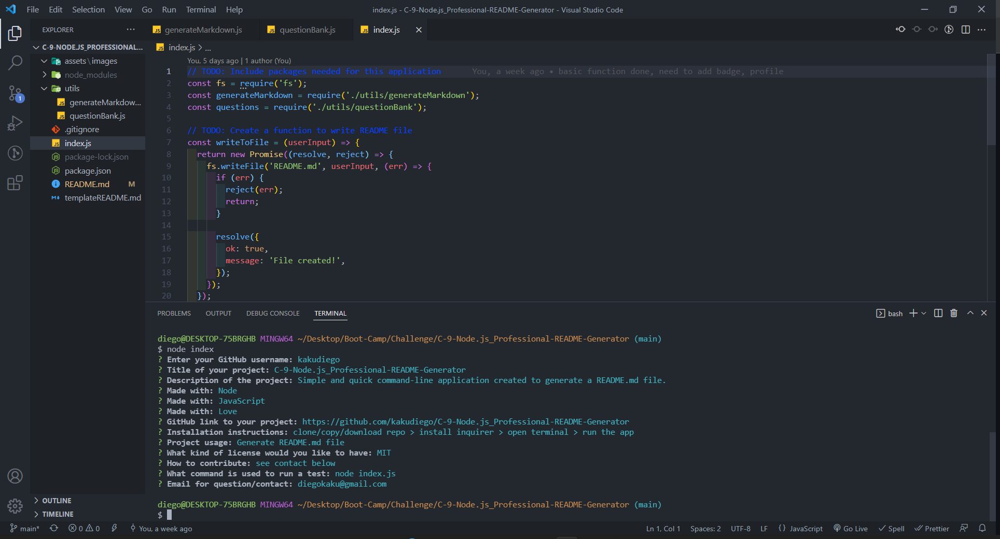
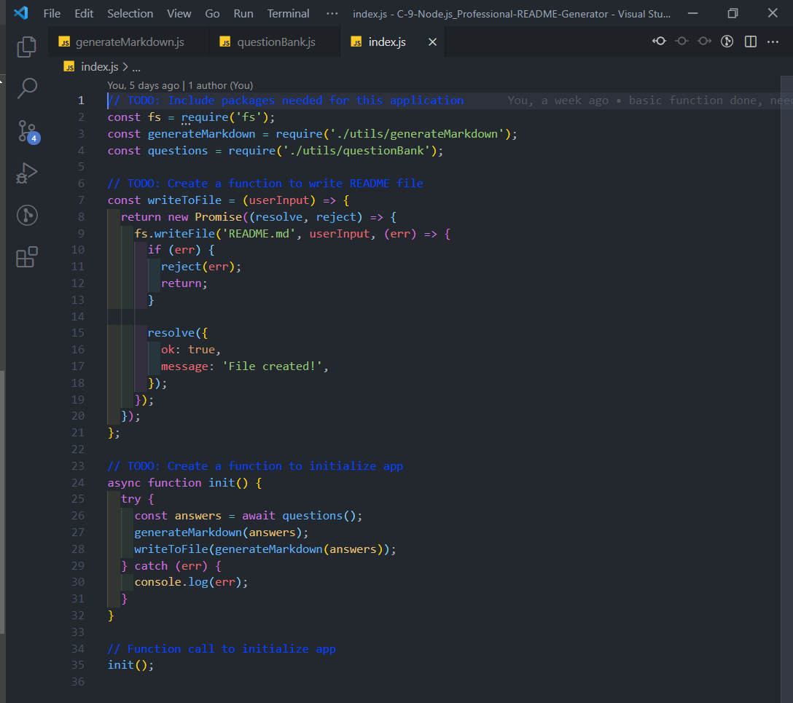
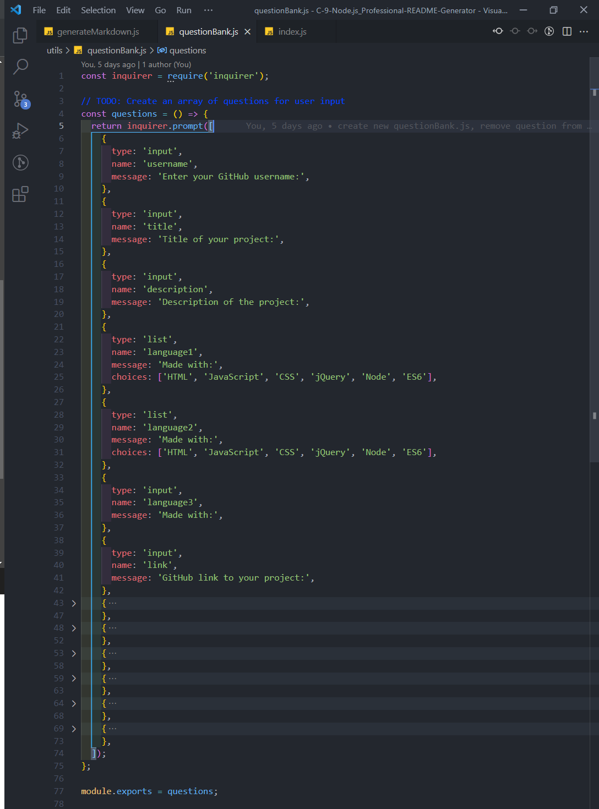
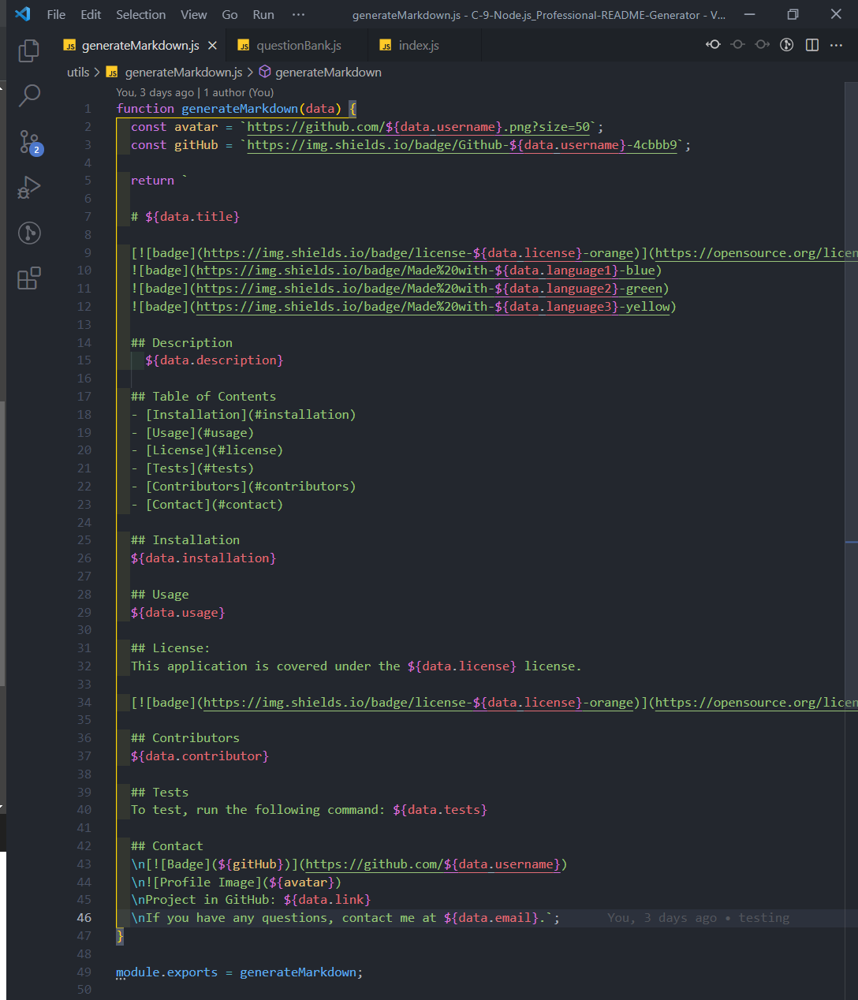

The following images demonstrates the application functionality and the an example README.md.

#### Command-line questions:

#### index.js file

#### questionBank.js

#### generateMarkdown.js

# C-9-Node.js_Professional-README-Generator

## Description

    Simple and quick command-line application created to generate a README.md file.

## Table of Contents

- [Installation](#installation)
- [Usage](#usage)
- [License](#license)
- [Tests](#tests)
- [Contributors](#contributors)
- [Contact](#contact)

## Installation

clone/copy/download repo > install inquirer > open terminal > run the app

## Usage

Generate README.md file

## License:

This application is covered under the MIT license.

## Contributors

see contact below

## Tests

To test, run the following command: node index.js

## Contact

Project in GitHub: https://github.com/kakudiego/C-9-Node.js_Professional-README-Generator

If you have any questions, contact me at diegokaku@gmail.com.
